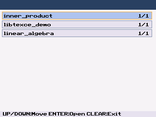
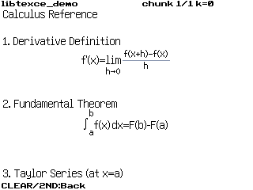

<h1 align="center">TI84+ CE Notes App Template</h1>

  
  

Generate a TI‑84 Plus CE notes app with formatted equations and text from your notes. No local setup is required.

## Quick Start
1. Click **Use this template** on GitHub and create your own repo
2. Add/Remove or edit files in `notes/` (via GitHub web editor or locally)
3. Commit/push to `main` (or `master`)
4. Open [**Actions**](https://github.com/Sightem/libtexce_notes_template/actions) -> **Build and Release** (left side) -> **Run workflow**
5. Wait for the run to finish
6. Download the `notes-template-artifacts` artifact from that run from the summary page
7. Transfer `NOTES_BUNDLE.8xg` to your calculator
8. Run `NOTES` on calculator

## What to Edit
- Put your note files in `notes/`
- Prefer `.tex` filenames for better GitHub syntax highlighting
- Note titles shown in-app come from filenames

Supported TeX/LaTeX-style commands are listed in [LATEX_COMMANDS_SUPPORTED.md](https://github.com/Sightem/libtexce_notes_template/blob/master/LATEX_COMMANDS_SUPPORTED.md)

## Which Files to Transfer
From the downloaded artifact, transfer:

- `NOTES_BUNDLE.8xg`

## Updating Notes
After each change:
1. Push changes
2. Run **Build and Release** manually from [**Actions**](https://github.com/Sightem/libtexce_notes_template/actions)
3. Download the newest `notes-template-artifacts`
4. Re-transfer `NOTES_BUNDLE.8xg`

## Optional Releases
If you create and push a tag like `v1.0.0`, the same build outputs are also attached to a GitHub Release automatically
